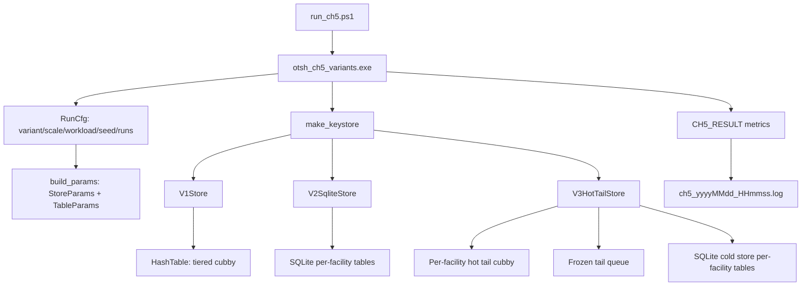
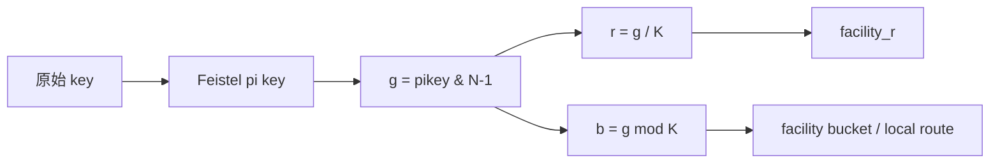
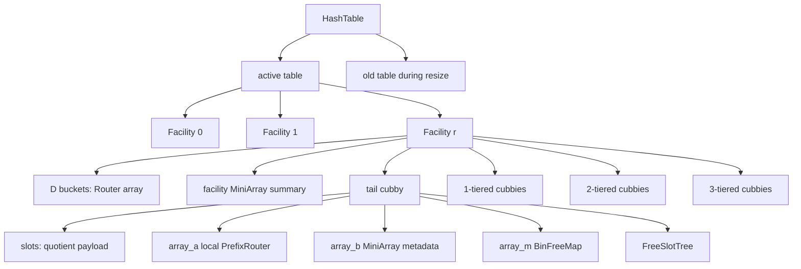
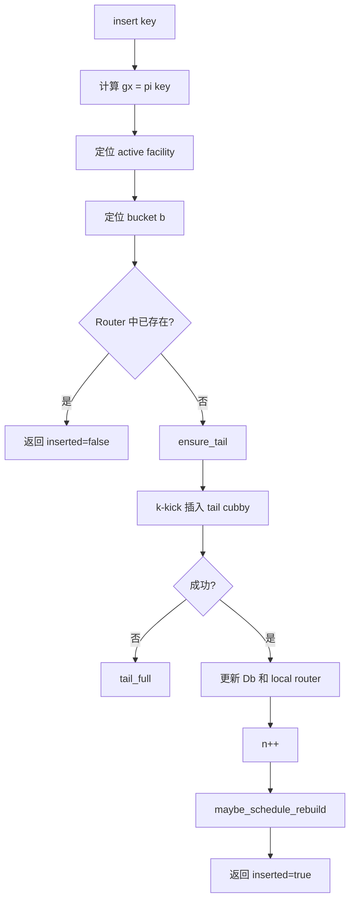
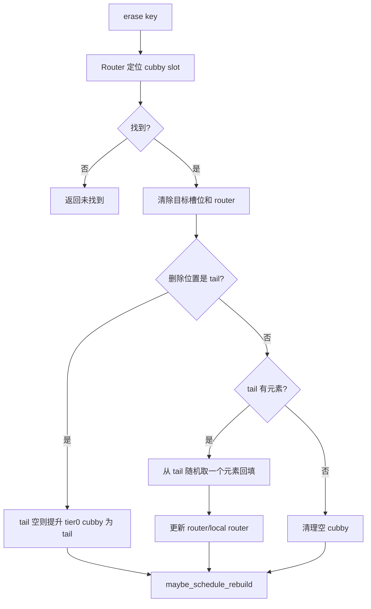
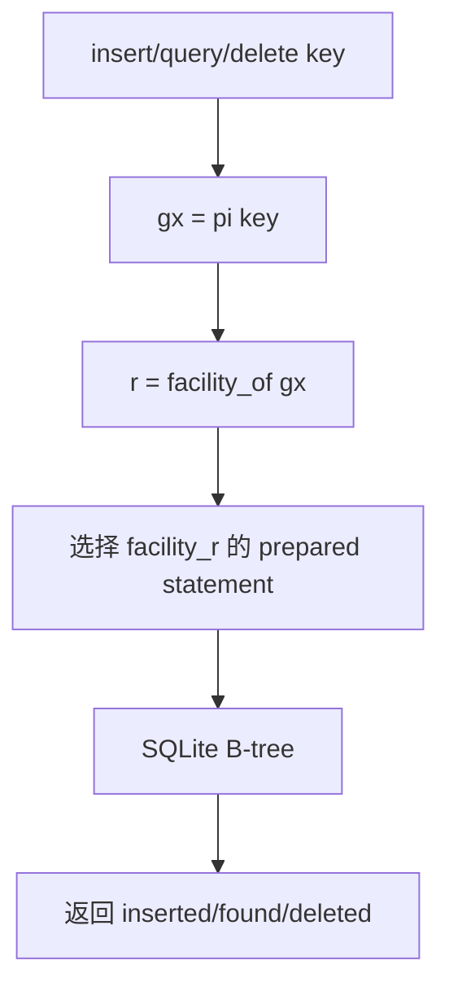
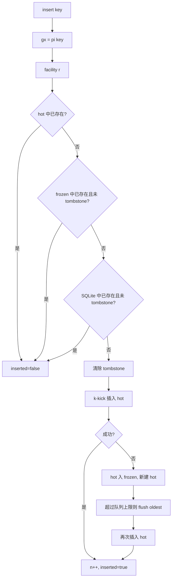
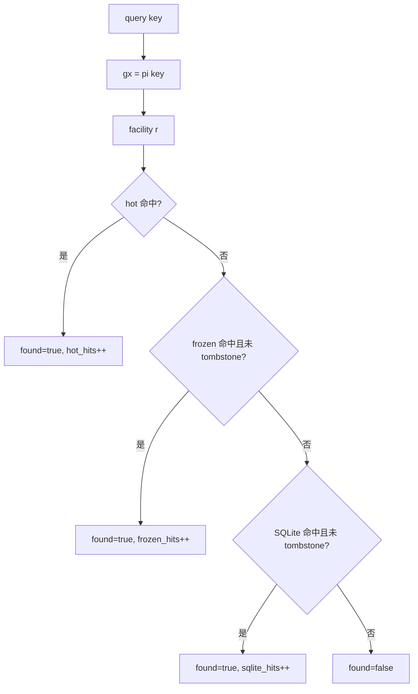
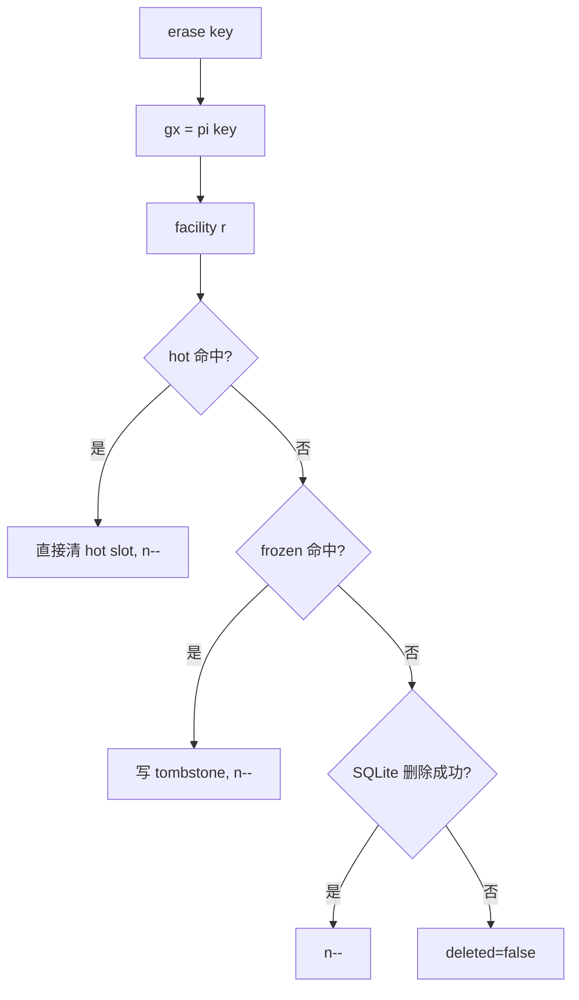
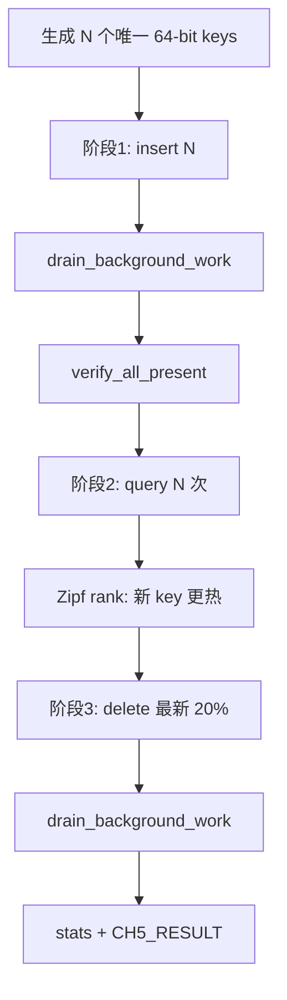

# OTSH 系统实现与 CH5 三方案实验说明

本文档梳理当前代码库中基于 k-kick tree/cubby 的哈希系统实现，以及第五章三方案对比实验的完整设计。重点说明三种方案如何实现、如何统一到同一套实验接口、实验数据如何生成、指标如何统计，以及为什么当前实验能体现 V3 hot-tail + SQLite 的优化点。

## 1. 系统目标

当前系统围绕一个支持 `insert / query / delete` 的键存储结构展开。原始方案 V1 是内存中的多层级 cubby 哈希结构；优化方案 V3 保留 tail cubby 作为热缓存，将更冷的数据落到 SQLite；对照方案 V2 则完全使用 SQLite。

三种方案的实验目标是回答：

1. 在相同 key 集合、相同规模、相同访问局部性下，三种方案的插入、查询、删除平均延迟如何变化。
2. 在相同最终存储 key 数量下，三种方案的 `bits_per_key` 空间占用如何变化。
3. V3 是否能利用 tail cubby 的近期局部性，在保持 SQLite 持久化能力的同时降低查询和删除热数据的成本。
4. 三种方案是否都能保证插入、查询、删除的正确性，即 `correctness_pct = 100%`。

## 2. 代码结构总览

核心文件如下：

| 模块 | 文件 | 作用 |
| --- | --- | --- |
| 原始哈希表 | `include/ht.h`, `src/ht.cpp` | V1 的核心实现，包含 `HashTable`、Feistel 置换、facility、多层 cubby、rebuild、resize |
| 统一接口 | `include/otsh/keystore.h`, `src/keystore.cpp` | 定义 `IKeyStore`、`StoreParams`、`StoreStats`、三方案工厂函数 |
| V1 包装 | `include/otsh/v1_store.h`, `src/v1_store.cpp` | 将原始 `HashTable` 包装为 `IKeyStore` |
| V2 SQLite | `include/otsh/v2_sqlite_store.h`, `src/v2_sqlite_store.cpp` | 纯 SQLite 实现，按 facility 下标 `r` 分表 |
| V3 hybrid | `include/otsh/v3_hot_tail_store.h`, `src/v3_hot_tail_store.cpp` | hot tail cubby + frozen tails + SQLite cold store |
| cubby 结构 | `include/otsh/cubby.h`, `include/otsh/facility.h` | 描述 cubby 内部数组、facility 层级结构 |
| k-kick | `include/otsh/kkick.h`, `src/kkick.cpp` | 单个 cubby 内的 k-kick 插入和踢出链 |
| 元数据编码 | `include/otsh/meta_entry.h`, `src/meta_entry.cpp` | quotient payload 和 `MetaEntry` 的编解码 |
| 路由器 | `include/otsh/router.h`, `src/router.cpp` | facility 级 Patricia router，用于定位 `(cubby, slot)` |
| 参数派生 | `include/otsh/system_params.h`, `src/system_params.cpp` | 根据 `n` 推导 `N`、`K`、fanout、tier 容量 |
| CH5 实验 | `experiments/ch5_variants.cpp` | V1/V2/V3 三方案统一实验入口 |
| CH5 脚本 | `experiments/run_ch5.ps1` | 构建、运行、记录 UTF-8 log |
| SQLite | `third_party/sqlite3/` | vendored SQLite amalgamation |

## 3. 总体架构



实验程序只依赖统一接口 `IKeyStore`，不直接关心底层是 V1、V2 还是 V3。因此三种方案共享同一套 workload、计时逻辑、正确性检查和空间统计。

## 4. 参数与哈希空间

### 4.1 TableParams

`TableParams` 是原始哈希系统的基础配置，定义在 `include/config.h`：

```cpp
struct TableParams {
    uint64_t n = 10000;
    int k = 4;
    int k_polylog_exp = 3;
    uint64_t K_override = 0;
    int node_max_bits = 2;
    int fanout_override = 0;
    int max_tier = 3;
    bool enable_rebuild_up = true;
    bool enable_rebuild_down = true;
    uint64_t seed1 = 0;
    uint64_t seed2 = 0;
    uint64_t seed3 = 0;
};
```

CH5 实验中固定的核心参数：

| 参数 | 实验取值 | 目的 |
| --- | --- | --- |
| `k` | 4 | 固定 k-kick 最大深度，避免额外变量 |
| `k_polylog_exp` | 3 | 使用 `K ~= log^3(N)` 的默认设计 |
| `node_max_bits` | 2 | MiniArray 叶子常数 |
| `max_tier` | 3 | V1 多层 cubby 最高三层 |
| `load_factor` | 0.90 | 保持较高装载率 |
| `enable_rebuild_up/down` | true | V1 保留多层 cubby rebuild 机制 |

### 4.2 DerivedParams

`derive_params()` 根据 `TableParams` 推导运行时参数：

```text
n_hint = max(2, p.n)
N      = next_pow2(n_hint)
K      = K_override or choose_K(N, k_polylog_exp)
k      = clamp(p.k, 3, 7)
fanout = fanout_override or floor(logN / (2 loglogN))
```

其中 `choose_K()` 会将 `K` 限制在 `[64, 4096]` 区间，并取不超过估计值的 2 的幂。因此实验中每个规模都有确定的 `N`、`K` 和 facility 数量。

### 4.3 Feistel 置换与 facility 分区

系统使用 `PermutationHash` 对原始 key 做 3 轮 Feistel 可逆置换：

```text
gx = pi(key)
g  = gx & (N - 1)
r  = g / K
b  = g mod K
```

含义：

- `pi(key)`：把原始 key 映射到伪随机 64 位空间。
- `N`：当前表的逻辑地址空间大小，2 的幂。
- `K`：每个 facility 的地址范围宽度。
- `r`：facility 下标。
- `b`：facility 内部 router bucket 下标。

V1、V2、V3 都使用同一种 `pi` 思路和相同的 `N/K` 派生逻辑。V2 和 V3 的 SQLite 表名也按 `r` 分裂为 `facility_<r>`，这是三方案公平比较的关键。



## 5. 统一存储接口

三种方案统一实现 `IKeyStore`：

```cpp
class IKeyStore {
public:
    virtual OpResult init(const StoreParams &p) = 0;
    virtual InsertResult insert(uint64_t key) = 0;
    virtual QueryResult query(uint64_t key) const = 0;
    virtual DeleteResult erase(uint64_t key) = 0;
    virtual OpResult bulk_load(const std::vector<uint64_t> &keys);
    virtual void drain_background_work() = 0;
    virtual StoreStats stats() const = 0;
    virtual StoreVariant variant() const = 0;
};
```

统一接口有几个好处：

1. 实验程序不需要为 V1、V2、V3 写三套 workload。
2. 三种方案的 latency 计时位置完全一致。
3. `stats()` 返回同一种空间统计结构，便于统一计算 `bits_per_key`。
4. `drain_background_work()` 让实验在统计空间占用前显式等待后台或延迟工作完成，例如 V1 的 rebuild/resize、V2 的 WAL checkpoint、V3 的 frozen tail flush。

`StoreStats` 中 CH5 实际使用的字段：

| 字段 | 含义 |
| --- | --- |
| `n` | 当前仍存在的 key 数量 |
| `mem_meta_bits` | 内存元数据 bit 数，V2 为 0 |
| `disk_file_bytes` | SQLite 主 DB 文件大小，不含 WAL/SHM |
| `runtime_overhead_bytes` | WAL/SHM 运行时文件大小，不计入 CH5 的 `bits_per_key` |
| `hot_hits/frozen_hits/sqlite_hits` | V3 或 V2 的命中统计，当前 CH5 log 不输出 |
| `flush_count/flushed_keys` | V3 flush 统计，当前 CH5 log 不输出 |

## 6. V1 原始多层 cubby 系统

### 6.1 数据结构

V1 由 `HashTable` 实现，核心状态是一个 active table，可选带一个 old table 用于 resize 迁移。



`Facility` 的核心成员：

- `D[b]`：facility 内 bucket router，保存 key 到 `(cubby*, slot)` 的定位。
- `ma`：facility 级 MiniArray 摘要，记录 bucket 元信息。
- `tail`：当前热插入 cubby。
- `tail_owned`：tail 的所有权。
- `tiers`：多层 cubby 集合，`tiers[0]` 为 1-tiered，`tiers[1]` 为 2-tiered，依此类推。

`Cubby` 的核心成员：

- `slots`：存储 quotient payload，而不是完整原始 key。
- `occupied`：记录占用槽位，便于遍历。
- `free_slots`：快速找到空槽位。
- `array_a`：local PrefixRouter，用于 cubby 内查询。
- `array_b`：MiniArray，存储 `MetaEntry` 编码。
- `array_m`：k-kick bin 空闲图。
- `kick_geom`：描述 k-kick 的 bin 切分与 probe 序列。

### 6.2 V1 插入流程

V1 的插入入口是 `HashTable::insert()`，内部调用 `insert_no_lock()`。



伪代码：

```text
function V1.insert(key):
    gx = pi(key)
    f  = facility_for_key(table, gx)
    b  = route_bucket_for(table, gx)

    if f.D[b].locate(key) exists:
        return inserted=false

    ensure_tail(table, f)

    result = kkick_insert(f, f.tail, key, facility_index(f))
    if result failed:
        return error tail_full

    n += 1
    maybe_schedule_rebuild(f)
    run_rebuild_budget()
    return inserted=true
```

`ensure_tail()` 的行为：

1. 如果当前 tail 存在且未满，继续使用。
2. 如果 tail 已满，将满 tail 放回 `tiers[0]`。
3. 调度 rebuild 检查。
4. 新建一个 1-tiered cubby 作为新的 tail。

### 6.3 V1 查询流程

V1 查询使用 facility 级 router 找到候选 `(cubby, slot)`，再用 cubby 中的 local router 和 metadata 校验。

```text
function V1.query(key):
    gx = pi(key)
    f  = facility_for_key(table, gx)
    b  = route_bucket_for(table, gx)

    loc = f.D[b].locate(key)
    if loc exists:
        found = query_cubby_via_local_router(loc.cubby, gx, facility_id, loc.slot)
        if found:
            return found=true

    return found=false
```

查询不是直接相信 router。router 只是快速给出候选位置，最终还会通过 cubby metadata 恢复或校验 `pi(key)`，避免错误命中。

### 6.4 V1 删除流程

V1 删除体现了原始多层 cubby 的一个关键逻辑：如果删除的元素不在 tail 中，就从 tail 取一个元素回填到被删除的位置。



伪代码：

```text
function V1.erase(key):
    gx = pi(key)
    f, b = locate facility and bucket
    loc = f.D[b].locate(key)

    if loc exists:
        clear loc.slot
        erase key from facility router and local router
        n -= 1

        if loc.cubby is tail:
            promote_tail_if_empty()
        else:
            ensure_tail()
            if tail has occupied slots:
                moved_key = random element from tail
                remove moved_key from tail
                write moved_key into deleted slot
                update routers
            prune_empty_cubby_from_tiers()

    maybe_schedule_rebuild()
    run_rebuild_budget()
```

这正是 V3 想优化的地方：原始 V1 为了维护多层 cubby 平衡，删除冷层元素时会触发 tail 回填和 router 更新；V3 去掉多层冷 cubby 后，热数据在 tail，冷数据在 SQLite，删除路径更直接。

### 6.5 V1  rebuild

V1 中保留 rebuild 作为后台或延迟维护：

当某层 cubby 数量过多或过少时，系统会在层级之间合并或拆分。表级 resize 和 active/old 双表迁移已移除，V1 始终使用初始化时推导出的单表 `N/K`。

### 6.6 V1 空间统计

V1 的 `bits_per_key` 来自 `HashTable::logical_meta_bits()`：

```text
mem_meta_bits =
    sum over facility routers D[b].bits_total()
  + sum over occupied cubby slots array_b.bitlen(slot)

bits_per_key = mem_meta_bits / current_n
```

当前统计口径故意不把 C++ 原型运行时对象开销计入，例如 `std::vector` capacity、指针、mutex 等。原因是实验要比较逻辑结构占用，而不是 C++ 原型容器的工程开销。

另外，`Router::bits_total()` 当前按紧凑逻辑编码估计：

- 每个叶子使用 16-bit verifier/fingerprint。
- 加上定位 slot 所需的 `slot_bits`。
- 不再按每个 router entry 重复计算完整 64-bit 原始 key。

这样 V1 的 `bits_per_key` 更接近论文结构的逻辑空间口径，也更适合与 V2/V3 的 SQLite 文件占用作对比。

## 7. V2 纯 SQLite 方案

### 7.1 设计目标

V2 是纯 SQLite baseline。它不使用 tail cubby，也不使用多层 cubby。每次插入、查询、删除都直接访问 SQLite。

为了与 V3 公平对比，V2 也按 facility 下标 `r` 分表，而不是使用单个大表。

### 7.2 SQLite 表结构

V2 初始化时会根据 `N/K` 创建多张表：

```sql
CREATE TABLE IF NOT EXISTS facility_<r> (
    key INTEGER PRIMARY KEY
) WITHOUT ROWID;
```

SQLite 配置：

```sql
PRAGMA journal_mode = WAL;
PRAGMA synchronous = NORMAL;
PRAGMA cache_size = -65536;
PRAGMA temp_store = MEMORY;
PRAGMA mmap_size = 268435456;
PRAGMA wal_autocheckpoint = 1000;
```

每个 facility 都有三条 prepared statement：

```sql
INSERT OR IGNORE INTO facility_<r>(key) VALUES(?1);
SELECT 1 FROM facility_<r> WHERE key=?1;
DELETE FROM facility_<r> WHERE key=?1;
```

### 7.3 V2 数据流



伪代码：

```text
function V2.insert(key):
    r = facility_of(pi(key))
    execute INSERT OR IGNORE INTO facility_r
    if sqlite_changes > 0:
        n += 1
        return inserted=true
    return inserted=false

function V2.query(key):
    r = facility_of(pi(key))
    execute SELECT 1 FROM facility_r WHERE key = ?
    return found = sqlite row exists

function V2.erase(key):
    r = facility_of(pi(key))
    execute DELETE FROM facility_r WHERE key = ?
    if sqlite_changes > 0:
        n -= 1
        return deleted=true
    return deleted=false
```

### 7.4 V2 空间统计

V2 没有内存元数据，空间统计为：

```text
mem_meta_bits = 0
disk_file_bytes = size(main .db)
runtime_overhead_bytes = size(.db-wal) + size(.db-shm)
bits_per_key = disk_file_bytes * 8 / current_n
```

注意：CH5 的 `bits_per_key` 只计入 SQLite 主 DB 文件，不计入 WAL/SHM。WAL/SHM 属于运行时开销，`StoreStats` 单独保留，但当前 `CH5_RESULT` 不输出。

实验中每次 run 结束前会调用 `drain_background_work()`，V2 会执行：

```cpp
sqlite3_wal_checkpoint_v2(db, nullptr, SQLITE_CHECKPOINT_TRUNCATE, nullptr, nullptr);
```

这样可以尽量把 WAL 内容 checkpoint 回主 DB，避免把 WAL 临时文件误算为空间占用。

## 8. V3 hot-tail + SQLite 方案

### 8.1 设计目标

V3 是本系统的创新优化方案：

1. 保留每个 facility 的 hot tail cubby，承接近期插入和近期访问。
2. 去掉 V1 的多层 cold cubby 结构。
3. tail 满后不进入多层 cubby，而是变成 frozen tail。
4. frozen tail flush 时恢复原始 key，并批量写入对应的 SQLite `facility_<r>` 表。
5. 查询时先查 hot tail，再查 frozen tails，最后查 SQLite。
6. 删除热数据时直接在内存中处理，删除冷数据时同步删除 SQLite。

当前实现中，flush 被抽象为“后台工作”，但为了实验可控性，主要由 `rotate_locked()` 的背压 flush 和 `drain_background_work()` 的同步 drain 完成；没有依赖不可控的长期后台线程调度。

### 8.2 V3 数据结构

每个 facility 有一个 `PerFacility`：

```cpp
struct PerFacility {
    std::unique_ptr<Cubby> hot;
    std::deque<std::unique_ptr<Cubby>> frozen;
    std::unordered_set<uint64_t> tombstones;
    mutable std::mutex mu;
};
```

含义：

- `hot`：当前可写 tail cubby。
- `frozen`：已冻结、等待 flush 到 SQLite 的 tail cubby 队列。
- `tombstones`：删除 frozen 中元素时记录逻辑删除，flush 时跳过。
- `mu`：每个 facility 独立加锁。

V3 的 cold store 是抽象接口：

```cpp
class ColdStore {
    virtual bool contains(size_t r, uint64_t key) = 0;
    virtual bool erase(size_t r, uint64_t key) = 0;
    virtual void bulk_insert(size_t r, const std::vector<uint64_t>& keys) = 0;
};
```

当前 CH5 使用 `SqliteColdStore`，它和 V2 一样按 `facility_<r>` 分表。

### 8.3 V3 初始化

```text
function V3.init(params):
    derived = derive_params(params.table)
    N = derived.N
    K = derived.K
    n_facilities = max(1, N / K)
    tail_capacity = params.tail_capacity_override
                    or min(K, max(64, K / 16))

    initialize Feistel pi seeds

    for each facility r:
        create hot cubby with tail_capacity
        create empty frozen queue
        create empty tombstones

    open SQLite cold store
    create facility_<r> tables
```

V3 的 tail 容量默认是：

```text
tail_capacity = min(K, max(64, K / 16))
```

这使 tail 具有足够的热缓存容量，而不是完全沿用 V1 中很小的 1-tiered cubby 容量。

### 8.4 V3 插入流程



伪代码：

```text
function V3.insert(key):
    gx = pi(key)
    r  = facility_of(gx)
    f  = facs[r]

    lock f

    if key found in f.hot:
        return inserted=false

    if key found in any frozen cubby and key not tombstoned:
        return inserted=false

    if cold.contains(r, key) and key not tombstoned:
        return inserted=false

    f.tombstones.erase(key)

    if kkick_insert(f.hot, key) fails:
        rotate_locked(f, r)
        if kkick_insert(f.hot, key) still fails:
            return error

    n += 1
    return inserted=true
```

### 8.5 V3 rotate 与 flush

当 hot tail 满或 k-kick 插入失败时，V3 执行 rotate：

```text
function rotate_locked(f, r):
    f.frozen.push_back(move(f.hot))
    f.hot = new empty tail cubby

    while f.frozen.size > frozen_queue_max:
        flush_oldest_locked(f, r)
```

`frozen_queue_max` 默认是 4。超过上限时，插入线程会被迫 flush oldest frozen tail，这就是背压机制，避免 frozen 队列无限增长。

flush 过程：

```text
function flush_oldest_locked(f, r):
    cubby = f.frozen.pop_front()
    keys = []

    for each occupied slot in cubby:
        key = recover_key_from_slot(cubby, slot, r, N, K, pi)
        if key in tombstones:
            remove tombstone
            continue
        keys.push_back(key)

    cold.bulk_insert(r, keys)
    flush_count += 1
    flushed_keys += keys.size
```

关键点：

- Cubby 内只保存 quotient payload 和 metadata，因此 flush 时需要通过 `recover_key_from_slot()` 反推 `pi(key)`，再用 `pi.inverse()` 恢复原始 key。
- frozen cubby 是只读的。删除 frozen 中的 key 时不能直接改 frozen cubby，而是写 tombstone。
- flush 时遇到 tombstone 就跳过，避免已删除 key 进入 SQLite。

### 8.6 V3 查询流程



伪代码：

```text
function V3.query(key):
    gx = pi(key)
    r  = facility_of(gx)
    f  = facs[r]

    lock f

    if lookup_in_cubby(f.hot, gx):
        hot_hits += 1
        return found=true

    for frozen in f.frozen:
        if lookup_in_cubby(frozen, gx) and key not in tombstones:
            frozen_hits += 1
            return found=true

    if cold.contains(r, key) and key not in tombstones:
        sqlite_hits += 1
        return found=true

    return found=false
```

该流程是 V3 的主要优化点。实验 workload 使用“越新的 key 越热”的查询分布，因此大量查询会命中 hot tail 或 frozen tail，减少 SQLite 查询次数。

### 8.7 V3 删除流程



伪代码：

```text
function V3.erase(key):
    gx = pi(key)
    r  = facility_of(gx)
    f  = facs[r]

    lock f

    if key found in hot:
        clear slot in hot
        remove tombstone if any
        n -= 1
        return deleted=true

    if key found in frozen:
        if tombstone newly inserted:
            n -= 1
            return deleted=true
        return deleted=false

    if cold.erase(r, key):
        remove tombstone if any
        n -= 1
        return deleted=true

    return deleted=false
```

对比 V1，V3 删除 hot key 时直接清 slot，不需要从 tail 回填到其他层；删除 frozen key 时只写 tombstone；删除 cold key 时直接 SQLite `DELETE`。

### 8.8 V3 空间统计

V3 的 `bits_per_key` 同时包含内存 hot/frozen 元数据和 SQLite 主 DB：

```text
mem_meta_bits =
    sum over occupied hot slots array_b.bitlen(slot)
  + sum over occupied frozen slots array_b.bitlen(slot)

disk_file_bytes = SQLite main DB size

bits_per_key = (mem_meta_bits + disk_file_bytes * 8) / current_n
```

同样，WAL/SHM 只作为 `runtime_overhead_bytes`，不计入 CH5 输出的 `bits_per_key`。

## 9. V1/V2/V3 对比总结

| 维度 | V1 原始多层 cubby | V2 纯 SQLite | V3 hot-tail + SQLite |
| --- | --- | --- | --- |
| 热数据位置 | tail cubby | SQLite | hot tail cubby |
| 冷数据位置 | 多层 cubby | SQLite | SQLite |
| facility 分区 | 内存 facility | SQLite `facility_<r>` | 内存 facility + SQLite `facility_<r>` |
| 插入路径 | tail cubby + k-kick | SQLite insert | hot tail k-kick，满后 rotate |
| 查询路径 | router + cubby metadata | SQLite select | hot -> frozen -> SQLite |
| 删除路径 | 删除后可能 tail 回填 | SQLite delete | hot 直接删，frozen tombstone，cold SQLite delete |
| 后台维护 | rebuild/resize | WAL checkpoint | frozen flush + WAL checkpoint |
| 空间来源 | 内存逻辑元数据 | DB 主文件 | 内存 tail 元数据 + DB 主文件 |
| 预期优势 | 内存查询快 | 实现简单、持久化 | 热数据快，冷数据持久化，降低多层维护复杂度 |

## 10. CH5 实验设计

### 10.1 实验入口

CH5 实验由两层组成：

1. `experiments/ch5_variants.cpp`：真正执行实验逻辑。
2. `experiments/run_ch5.ps1`：负责构建、分组运行、生成日志。

常用命令：

```powershell
# 默认：all variants, scale=1e4, core workload
.\experiments\run_ch5.ps1

# 五组规模全部运行
.\experiments\run_ch5.ps1 -Variant all -Scale all -Workload core

# 只跑 V3
.\experiments\run_ch5.ps1 -Variant V3 -Scale all -Workload core

# quick 冒烟测试，每个 scale 实际只跑最多 1000 个 key
.\experiments\run_ch5.ps1 -Variant all -Scale all -Workload core -Quick

# 多 seed 重复
.\experiments\run_ch5.ps1 -Variant all -Scale all -Workload core -Runs 3 -Seed 42
```

### 10.2 实验规模

当前五组正式规模：

```text
5e3, 1e4, 5e4, 1e5, 5e5
```

在 C++ 中：

```cpp
scales = {
    {"5e3", 5'000},
    {"1e4", 10'000},
    {"5e4", 50'000},
    {"1e5", 100'000},
    {"5e5", 500'000}
};
```

在 PowerShell 中：

```powershell
$scaleList = if ($Scale -eq "all") {
  @("5e3", "1e4", "5e4", "1e5", "5e5")
} else {
  @($Scale)
}
```

### 10.3 实验变量

| 变量 | 取值 | 说明 |
| --- | --- | --- |
| `variant` | `V1`, `V2`, `V3`, `all` | 三种方案或全部 |
| `scale` | `5e3`, `1e4`, `5e4`, `1e5`, `5e5`, `all` | key 数量规模 |
| `workload` | `core`, `all` | 当前 `all` 也只展开为 `core` |
| `seed` | 默认 1 | 控制 key 生成和 Zipf 查询 |
| `runs` | 默认 1 | 多次重复，每次 seed 自增 |
| `quick` | 默认 false | true 时 `base_n = min(scale.n, 1000)` |
| `keep-db` | 默认 false | true 时保留 SQLite DB 文件 |

### 10.4 脚本运行策略

`run_ch5.ps1` 当前采用外层脚本隔离运行：

```text
for scale in scaleList:
    for variant in variantList:
        for workload in workloadList:
            launch otsh_ch5_variants.exe once
```

每个 `scale x variant x workload` 都单独启动一次 `otsh_ch5_variants.exe`。这样做有三个目的：

1. 避免 V1 大规模运行后的内存状态影响 V2/V3。
2. 如果某一组异常退出，日志能明确定位到具体 variant 和 scale。
3. 后续组不依赖前一组进程内状态，实验更稳定。

日志写入使用统一的 UTF-8 no BOM：

```powershell
$Utf8NoBom = New-Object System.Text.UTF8Encoding $false
[System.IO.File]::WriteAllText($logPath, "", $Utf8NoBom)
[System.IO.File]::AppendAllText($logPath, $Line + [Environment]::NewLine, $Utf8NoBom)
```

这样避免 Windows PowerShell 中 `Tee-Object -Append` 与 `Add-Content` 混用导致的混合编码问题。

### 10.5 core workload

当前 CH5 只保留一个核心 workload：`core`。

它由三个阶段组成：



更具体地说：

1. 生成 `base_n` 个唯一 64-bit key。
2. 插入全部 key，统计 `insert_avg_us`。
3. 调用 `store.drain_background_work()`，让延迟工作收尾。
4. 调用 `verify_all_present()`，确认刚插入的 key 全部可查。
5. 查询 `base_n` 次，查询目标按 Zipf rank 采样，rank 0 对应最新 key。
6. 删除最新的 `base_n / 5` 个 key，即 20%。
7. 再次调用 `store.drain_background_work()`。
8. 调用 `store.stats()`，计算 `bits_per_key` 和 `correctness_pct`。

伪代码：

```text
function run_workload(cfg, store):
    base_n = cfg.quick ? min(cfg.scale.n, 1000) : cfg.scale.n
    keys = gen_unique_keys(base_n, cfg.seed)

    expected_inserts += base_n
    for key in keys:
        time store.insert(key)
        if inserted:
            inserts_done += 1
    store.drain_background_work()

    if not verify_all_present(store, keys):
        correctness_ok = false
        return

    query_rank = ZipfSampler(base_n, alpha=1.1)
    expected_queries += base_n
    for i in 1..base_n:
        idx = sample_zipf_newer_index(keys.size, query_rank)
        time store.query(keys[idx])
        queries_done += 1
        if found:
            queries_found += 1

    delete_n = max(1, base_n / 5)
    expected_deletes += delete_n
    for i in 0..delete_n-1:
        key = keys[keys.size - 1 - i]
        time store.erase(key)
        if deleted:
            deletes_done += 1

    store.drain_background_work()

    if inserts_done != expected_inserts
       or queries_found != expected_queries
       or deletes_done != expected_deletes:
        correctness_ok = false
```

### 10.6 为什么 workload 强调“新 key 更热”

V3 的核心假设是：真实系统中近期写入的数据更可能被再次访问或删除。为了体现这一点，query 和 delete 都围绕近期 key 设计：

- 查询：使用 Zipf 分布，rank 0 对应最新 key，rank 越大 key 越旧。
- 删除：删除最新 20% 的 key。

这不是只偏向 V3 的“不公平测试”，原因是：

1. V1、V2、V3 使用完全相同的 key 集合。
2. V1、V2、V3 使用完全相同的 query 序列。
3. V1、V2、V3 使用完全相同的 delete 目标。
4. 访问局部性是很多实际系统的常见 workload 特征。
5. V2 也按 facility 分表，避免把 V3 的 per-facility SQLite 分区优势单独放大。

因此这个 workload 的目的不是人为削弱 V2，而是在公平输入下展示 V3 对“近期局部性”的利用能力。

### 10.7 key 生成

`gen_unique_keys()` 使用 `std::mt19937_64` 和 `unordered_set` 生成唯一 key：

```text
function gen_unique_keys(n, seed):
    rng = mt19937_64(seed xor constant)
    seen = empty set
    out = []

    while out.size < n:
        k = rng()
        if k == 0:
            continue
        if k not in seen:
            seen.insert(k)
            out.push_back(k)

    return out
```

每个 run 的 seed 是：

```text
cfg.seed = base_seed + run_index
```

因此多次 `-Runs` 会生成不同 key 集合，但仍可复现。

### 10.8 查询采样

查询采样使用 `ZipfSampler(n, alpha=1.1)`：

```text
weight(rank i) = 1 / (i + 1)^1.1
```

然后通过 `sample_zipf_newer_index()` 把 rank 映射到 key 下标：

```text
rank 0 -> keys[n - 1]      最新 key
rank 1 -> keys[n - 2]
...
rank n-1 -> keys[0]        最旧 key
```

伪代码：

```text
function sample_zipf_newer_index(n, zipf):
    rank = min(zipf.sample(), n - 1)
    return (n - 1) - rank
```

这样查询会更频繁访问最近插入的 key。

### 10.9 删除目标

删除阶段删除最新 20%：

```text
delete_n = max(1, base_n / 5)
for i in 0..delete_n-1:
    key = keys[keys.size - 1 - i]
    erase(key)
```

删除最新数据可以测试：

- V1：删除是否触发 tail 或多层 cubby 的维护。
- V2：SQLite 直接删除的成本。
- V3：hot tail/frozen tail/tombstone 路径是否能降低热删除成本。

删除后最终 key 数：

```text
current_n = base_n - delete_n = 0.8 * base_n
```

`bits_per_key` 使用这个最终 `current_n` 作为分母。

## 11. 指标统计方式

CH5 最终只输出五个核心指标：

```text
insert_avg_us
query_avg_us
delete_avg_us
bits_per_key
correctness_pct
```

### 11.1 平均延迟

每个操作使用 `std::chrono::steady_clock` 单独计时：

```text
latency_ns = time_after_operation - time_before_operation
```

统计方式：

```text
insert_avg_us = average(insert_latency_ns) / 1000
query_avg_us  = average(query_latency_ns) / 1000
delete_avg_us = average(delete_latency_ns) / 1000
```

注意：

- `verify_all_present()` 的查询不计入 `query_avg_us`。
- `drain_background_work()` 不计入单次 insert/query/delete 平均延迟。
- `elapsed=...ms` 会输出在辅助日志中，但不是最终核心指标。

这样做的目的是让最终表格聚焦于操作本身的平均成本。

### 11.2 bits_per_key

统一计算公式：

```text
bits_per_key =
    (StoreStats.mem_meta_bits + StoreStats.disk_file_bytes * 8)
    / StoreStats.n
```

三种方案的具体含义：

| 方案 | `mem_meta_bits` | `disk_file_bytes` | `bits_per_key` 解释 |
| --- | --- | --- | --- |
| V1 | facility router + occupied cubby metadata | 0 | 原始多层 cubby 的逻辑元数据位数/key |
| V2 | 0 | SQLite 主 DB 文件 | SQLite 持久化文件位数/key |
| V3 | hot/frozen cubby metadata | SQLite 主 DB 文件 | 热缓存元数据 + 冷存储文件位数/key |

不计入的内容：

- SQLite WAL/SHM 文件。
- C++ 容器运行时开销。
- mutex、指针、vector capacity 等工程对象开销。

原因是 `bits_per_key` 要表达数据结构逻辑空间和持久化主体空间，而不是调试原型的运行时对象成本。

### 11.3 correctness_pct

正确性统计公式：

```text
expected_total =
    expected_inserts + expected_queries + expected_deletes

success_total =
    inserts_done + queries_found + deletes_done

correctness_pct =
    100 * success_total / expected_total
```

其中：

- `expected_inserts = base_n`
- `expected_queries = base_n`
- `expected_deletes = max(1, base_n / 5)`
- `inserts_done` 统计实际新插入成功的数量。
- `queries_found` 统计 workload 查询中实际找到的数量。
- `deletes_done` 统计实际删除成功的数量。

如果三种操作任何一个数量不匹配，`correctness_ok=false`，日志会输出错误详情。

## 12. 输出日志格式

每组实验输出一段人类可读日志和一行机器可解析结果：

```text
[CH5] variant=V3 scale=5e3 workload=core seed=1 quick=0
  ok=1 correctness=1 elapsed=...ms ins=5000 qry=5000 del=1000 n=4000
  insert_avg=...us query_avg=...us delete_avg=...us bits_per_key=... correctness=100.000%
CH5_RESULT variant=V3 scale=5e3 workload=core insert_avg_us=... query_avg_us=... delete_avg_us=... bits_per_key=... correctness_pct=100.000
```

正式写论文或汇总表时，建议只提取 `CH5_RESULT` 行。

可用 PowerShell 提取：

```powershell
Select-String "CH5_RESULT" .\experiments\ch5_*.log
```

## 13. 实验公平性设计

### 13.1 相同输入

对每个 `(scale, seed)`：

- V1、V2、V3 使用同一个 `gen_unique_keys()` 生成逻辑。
- 查询序列由同一个 Zipf sampler 参数产生。
- 删除目标都是最新 20%。

### 13.2 相同哈希分区公式

V2 和 V3 都使用：

```text
r = ((pi(key) & (N - 1)) / K) mod n_facilities
```

并写入：

```text
facility_<r>
```

因此 V2 不再是单表 SQLite，而是和 V3 一样 per-facility 分表。这样可以避免 V3 因分表而独占优势。

需要注意的是，当前实现中 `pi` 的种子除 `seed1/seed2/seed3` 外，还混入了 `high_resolution_clock`。因此不同进程、不同 variant 的具体 facility 映射不保证逐位相同；公平性主要来自相同的分区公式、相同的 `N/K` 派生、相同 key 集合和相同访问序列。如果后续需要严格复现实验中的每个 key 到同一 facility 的映射，可以把 `pi` 初始化改为只依赖显式 seed。

### 13.3 相同参数规模

三种方案都通过同一个 `build_params()` 设置：

```text
n = scale.n
k = 4
k_polylog_exp = 3
node_max_bits = 2
max_tier = 3
load_factor = 0.90
enable_rebuild_up = true
enable_rebuild_down = true
```

V2 虽然不用 cubby，但仍用这些参数推导 `N/K/n_facilities`，保证 SQLite 分表数量与 V3 对齐。

### 13.4 进程隔离

脚本为每个组合单独启动进程：

```text
V1 scale=5e3
V2 scale=5e3
V3 scale=5e3
V1 scale=1e4
V2 scale=1e4
V3 scale=1e4
...
```

这避免大规模 V1 运行后占用大量内存或残留状态，影响后续 V2/V3。

### 13.5 SQLite 文件隔离

V2/V3 的 SQLite 路径包含 variant、scale、workload、seed：

```text
test_output/ch5_db/<variant>_<scale>_<workload>_s<seed>.db
```

每次初始化会删除同名旧 DB、WAL、SHM、journal 文件，避免复用历史数据。

### 13.6 统计收尾

每组结束前调用：

```text
store.drain_background_work()
store.stats()
```

这保证：

- V1 尽量完成 rebuild/迁移预算。
- V2 执行 WAL checkpoint。
- V3 flush frozen tail 到 SQLite，并执行 cold store drain。

因此 `bits_per_key` 统计的是稳定终态，而不是中间态。

## 14. 如何解读实验结果

### 14.1 时间复杂度角度

从实验指标看：

- `insert_avg_us`：衡量插入路径平均成本。
- `query_avg_us`：衡量近期局部性查询下的平均查询成本。
- `delete_avg_us`：衡量删除近期 key 的平均成本。

理论上：

| 方案 | 插入预期 | 查询预期 | 删除预期 |
| --- | --- | --- | --- |
| V1 | 内存 k-kick，可能伴随 rebuild | 内存 router + cubby，通常快 | 多层维护和 tail 回填可能增加成本 |
| V2 | SQLite B-tree 插入 | SQLite B-tree 查询 | SQLite B-tree 删除 |
| V3 | hot tail k-kick，偶尔 rotate/flush | 热命中时内存查询，冷命中才 SQLite | hot 直接删，frozen tombstone，cold SQLite |

因此 V3 的优化主要应体现在：

1. `query_avg_us`：当查询集中在新 key 时，大量命中 hot/frozen，而不是 SQLite。
2. `delete_avg_us`：删除最新 20% 时，多数仍在 hot/frozen，避免纯 SQLite 删除或 V1 的多层回填。
3. `insert_avg_us`：插入先进入内存 hot tail，只有 tail 满后才 flush 到 SQLite，平摊成本可控。

### 14.2 空间占用角度

`bits_per_key` 应这样理解：

- V1：纯内存逻辑元数据空间。由于没有 SQLite 主文件，数值主要反映 router 和 cubby metadata。
- V2：纯 SQLite 主 DB 文件空间。小规模时 SQLite 页和表结构固定开销会较明显。
- V3：热缓存元数据 + SQLite 主 DB 文件空间。它通常不会比 V2 少很多，因为最终冷数据也要进 SQLite，但热 tail 部分可能尚未落盘，且增加少量内存元数据。

如果小规模下 V2/V3 `bits_per_key` 偏高，这是 SQLite 页大小、schema、B-tree 页面和 per-table 固定开销导致的正常现象。规模变大后，这些固定开销会被更多 key 摊薄。

### 14.3 correctness_pct

论文和报告中建议明确说明：

```text
所有有效实验组 correctness_pct 应为 100%，否则该组结果不能用于性能比较。
```

因为性能结果只有在插入、查询、删除都正确时才有意义。

## 15. 推荐实验执行流程

### 15.1 冒烟测试

先确认程序能运行、日志能打开、三方案都输出：

```powershell
.\experiments\run_ch5.ps1 -Variant all -Scale all -Workload core -Quick
```

检查：

1. 是否生成 `experiments/ch5_*.log`。
2. Cursor 是否能按文本打开 log。
3. 是否每个 scale 都有 V1/V2/V3。
4. 每行 `correctness_pct` 是否为 `100.000`。

### 15.2 正式单 seed 实验

```powershell
.\experiments\run_ch5.ps1 -Variant all -Scale all -Workload core -Seed 1
```

得到 5 个规模 x 3 个方案 = 15 行 `CH5_RESULT`。

### 15.3 多 seed 实验

如果时间允许：

```powershell
.\experiments\run_ch5.ps1 -Variant all -Scale all -Workload core -Runs 3 -Seed 1
```

得到 45 行 `CH5_RESULT`。后续可以对相同 `(variant, scale, workload)` 的三个 seed 取平均或中位数。

### 15.4 分方案排查

如果某个方案异常，可以单独运行：

```powershell
.\experiments\run_ch5.ps1 -Variant V1 -Scale 5e5 -Workload core
.\experiments\run_ch5.ps1 -Variant V2 -Scale 5e5 -Workload core
.\experiments\run_ch5.ps1 -Variant V3 -Scale 5e5 -Workload core
```

## 16. 论文或报告中的实验表建议

最终结果建议按规模组织，每个规模下列出三种方案：

| scale | variant | insert_avg_us | query_avg_us | delete_avg_us | bits_per_key | correctness_pct |
| --- | --- | ---: | ---: | ---: | ---: | ---: |
| 5e3 | V1 | log 提取 | log 提取 | log 提取 | log 提取 | 100 |
| 5e3 | V2 | log 提取 | log 提取 | log 提取 | log 提取 | 100 |
| 5e3 | V3 | log 提取 | log 提取 | log 提取 | log 提取 | 100 |

图表建议：

1. `scale` 为横轴，三条线分别为 V1/V2/V3。
2. 分别画四张图：`insert_avg_us`、`query_avg_us`、`delete_avg_us`、`bits_per_key`。
3. `correctness_pct` 不一定画图，可以在表格或文字中说明全部为 100%。

## 17. 当前实现的关键创新点

从本科创新设计角度，可以这样概括 V3：

1. 将原始多层 cubby 的 cold 层替换为 SQLite per-facility 持久化存储。
2. 保留 tail cubby 作为近期数据热缓存，继承原系统的 k-kick 高效内存插入与查询能力。
3. 通过 frozen tail 队列把 hot tail 的轮换和 SQLite 批量写入解耦。
4. 使用 tombstone 处理 frozen tail 中的删除，避免对只读 frozen cubby 做复杂原地修改。
5. V2 和 V3 都采用 `facility_<r>` 分表，确保对照公平。
6. 实验 workload 显式建模近期局部性，用相同输入展示 V3 的热缓存价值。

## 18. 当前实现边界

需要在论文或答辩中如实说明：

1. V3 当前实现主要通过 `drain_background_work()` 和 rotate 背压执行 flush，不依赖长期后台线程；这是为了让实验可重复、避免线程调度噪声。
2. `bits_per_key` 是逻辑空间口径，不是进程 RSS 或完整 C++ 对象内存。
3. SQLite 的小规模 `bits_per_key` 会受页面、schema、per-table 固定开销影响。
4. CH5 关闭 resize，是为了聚焦三方案 CRUD 和存储层差异；V1 的 resize 能力仍在原始 `HashTable` 中保留。
5. 当前 CH5 只输出 avg latency，不输出 P50/P99，以满足实验简化和本科报告可读性要求。
6. 当前 `pi` 初始化混入时间种子，因此 `--seed` 能复现 key 集和访问序列，但不能保证不同进程间的 facility 映射完全一致。

## 19. 一句话总结

当前系统通过 `IKeyStore` 将 V1 原始多层 cubby、V2 纯 SQLite、V3 hot-tail + SQLite 统一到同一套实验框架中。CH5 实验使用相同 key、相同 facility 分区公式、相同时间局部性 workload 和相同统计口径，对比三种方案的平均插入延迟、平均查询延迟、平均删除延迟、`bits_per_key` 与正确性。V3 的核心创新是用 tail cubby 承接热数据，用 SQLite 承接冷数据，从而在具备持久化能力的同时利用近期局部性降低热查询和热删除成本。